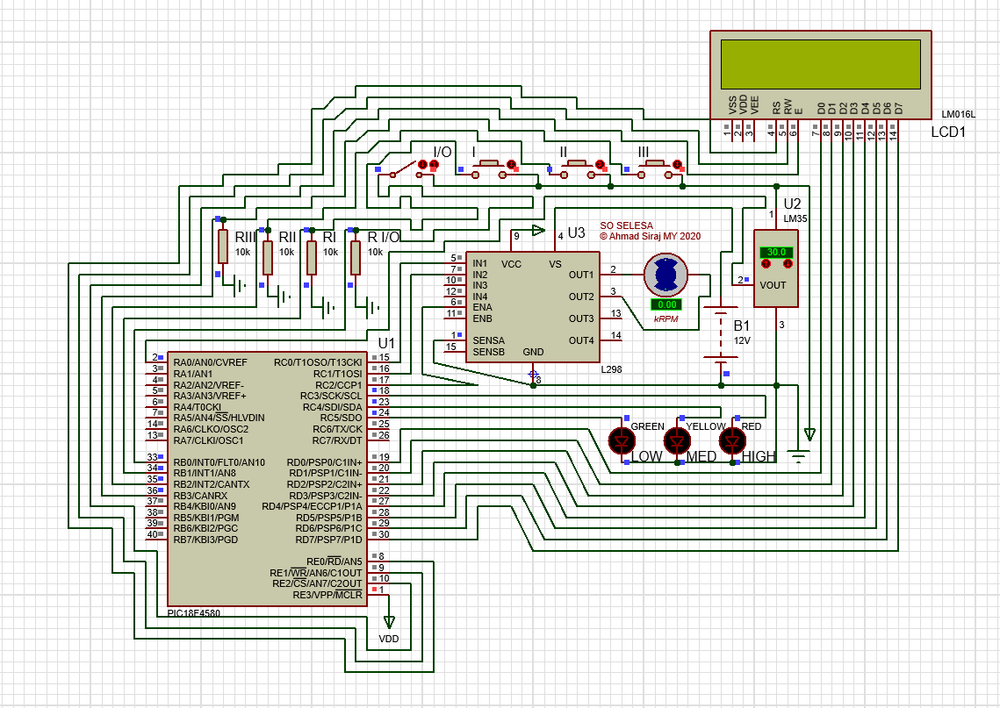
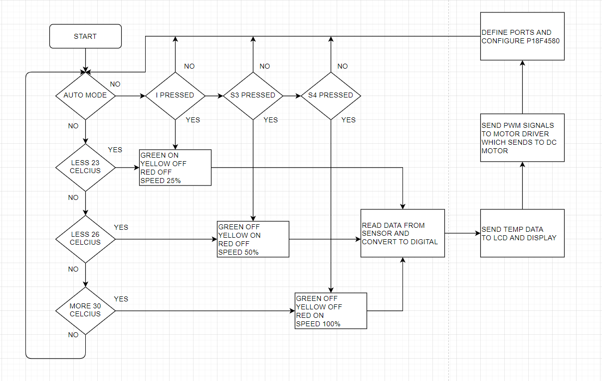
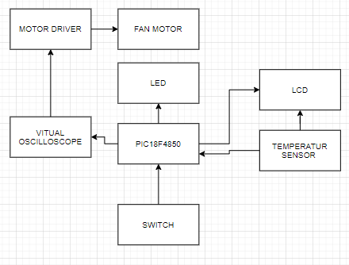
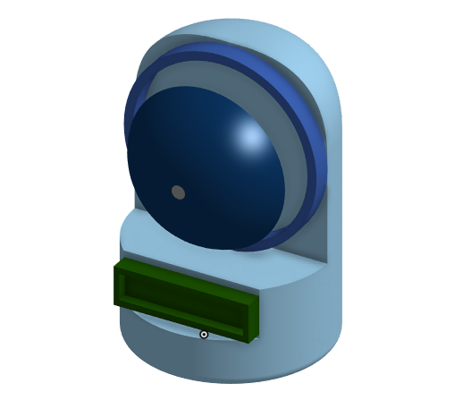

# So Selesa
Automatic Speed Fan using PIC18F Microcontroller

* Programming Language: C
* Microcontroller: PIC18F4580 
* Tools: Proteus Design Suite

So Selesa is a smart portable fan that is suitable for children, it circulates air inside the room that gives pleasant breeze to the child, it is made from PIC18F4580, 12V Battery and 5V power source with temperature sensor, LCD display to display the temperature and a couple of LEDs as status indicator. It reads the temperature inside the room and readjust the speed accordingly, there are 3 fan speeds which are low, medium and high.

### Problem Statement

Standing fans may pose danger to children in the day care facility, therefore there needs to be a way to reduce the danger and at the same time reduce power consumption in a smart way.

### Objective

1. To reduce day care facility accident caused by standing fans
2. To design a fan that consumes less energy
3. To develop a smart fan that recalibrates the speed by studying the current indoor temperature

### Scope

* The project will be a small prototype with PIC18F4580 simulated virtually
* The smart fan will be designed with Autodesk Inventor 2020

### Flow Chart

### Block Diagram

### Product Design

© Ahmad Siraj MY 2020
